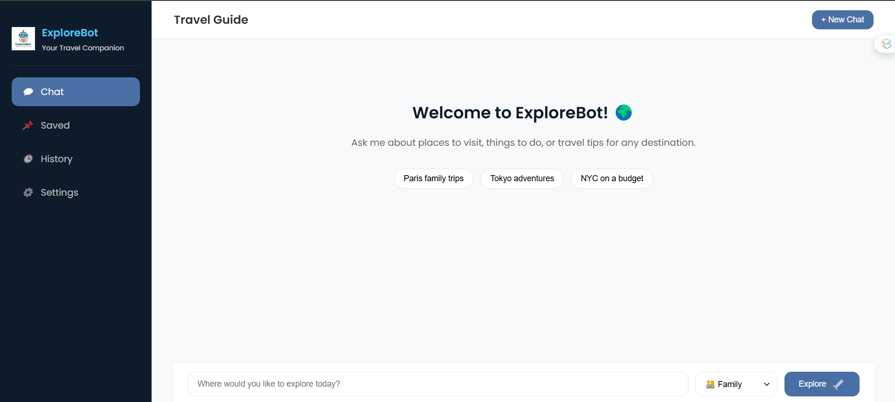
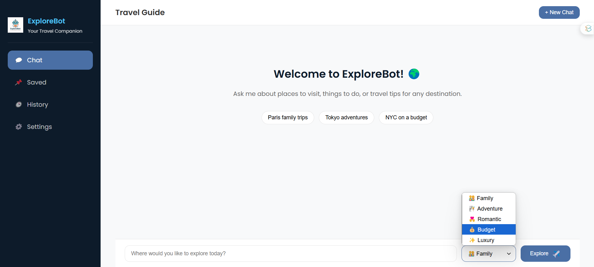
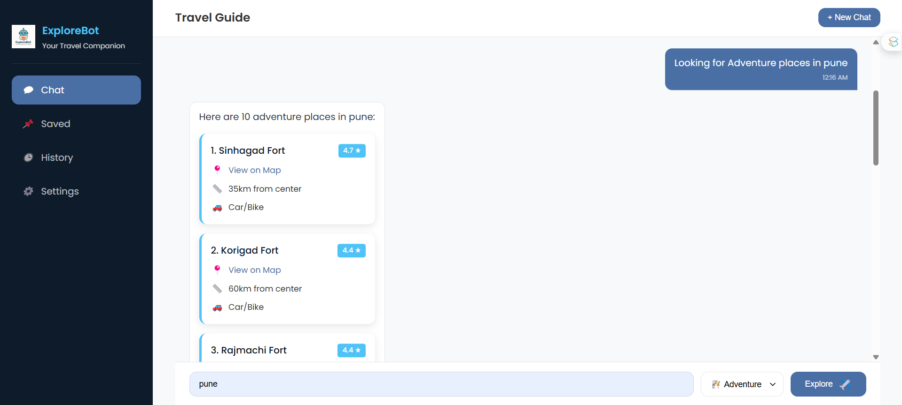

# 🌍 Explore Bot – AI Travel Guide Chatbot

Explore Bot is a smart travel companion powered by **Gemini API** that suggests the top 10 places to visit in any city based on your interests.

## ✨ Features

- 🔍 Get travel suggestions by category (Adventure, Family-friendly, Nature, etc.)
- 📍 Google Maps links for every place
- 🧭 Shows travel time, distance, and best travel mode from your location
- 💬 Chat-style UI (inspired by Tidio)
- 🗂 Sidebar navigation (Home, Saved, History, etc.)
- 🌐 No Google Maps API or Unsplash keys required!

---

## 📦 Tech Stack

- **Node.js** + **Express.js** – Backend server
- **HTML/CSS/JavaScript** – Frontend
- **Gemini API** – For AI-generated travel recommendations
- **Geolocation API** – Get user location

---

## ⚙️ Setup Instructions

### 1. Clone the Repository

```bash
git clone https://github.com/YOUR_USERNAME/explore-bot.git
cd explore-bot
```

### 2. Install Dependencies

```bash
npm install
```

### 3. Configure Environment Variables
```
Create a .env file in the root directory and add:
GEMINI_API_KEY=your_google_gemini_api_key
```

### 4. Run the Server
```
node server.js
```
Access the chatbot at: http://localhost:3001

📁 Folder Structure
```
explore-bot/
│
├── public/
|   └── images/
|       └── explorebot-logo.png    #logo
│   └── index.html                 # HTML File
|   └── script.js                  #client-side JS
|   └── style.css                  #stylesheet
├── .env            # Environment configuration
├── server.js       # Express backend
├── package.json    # Project metadata and dependencies
└── README.md       # Project overview and instructions
```
📸 UI Preview







🙌 Contributions Welcome!
Pull requests are welcome. Feel free to fork the repo and submit improvements!

📧 Contact
Made with 💙 by Karthik Kurup
Vishwakarma University
Email: kurupkarthik24@gmail.com
